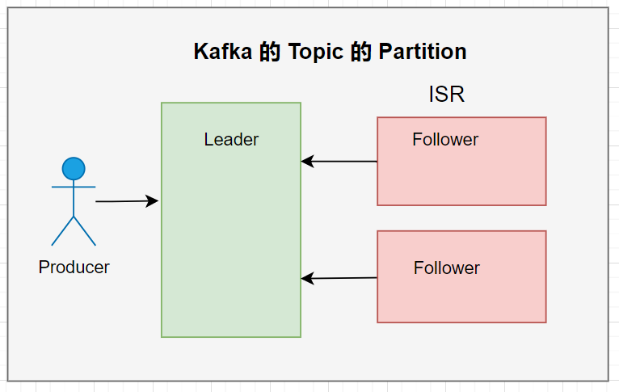
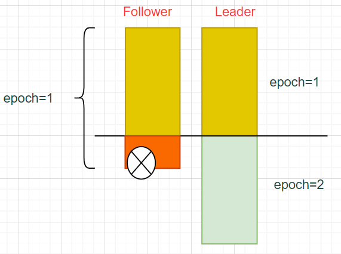

# 谈一谈 Kafka 在 CAP 三大特性之间做的妥协和改进

发布于 2023-03-03 09:03:17

7820

举报

文章被收录于专栏：[kk大数据](https://cloud.tencent.com/developer/column/79736)

**一、回忆 CAP 定理**

CAP 定理是分布式架构设计的基本理论，本身并不复杂。 是由三个单词组成，分别是：

- Consistency（一致性）
- Availability（可用性）
- Partitioning（分区容错性）

（1）一致性 一致性（**C**）代表更新操作成功后，所有节点在同一时间的数据完全一致； （2）可用性 可用性（**A**）代表用户访问数据时，系统是否能在正常响应时间返回预期的结果； （3）分区容错性 分区容错性（**P**)代表分布式系统在遇到某节点或网络故障的时候，仍然能够对外提供满足一致性或可用性的服务。 CAP定理说的就是，一个分布式系统不可能同时很好的满足 CAP 三个特性，最多只能同时较好的满足两个。

也就是要么满足CP、要么满足AP、要么满足CA。 不同的情况下有着不同的应用场景。

举一个电商系统常见的订单和库存系统来说明：

如上图，按照业务垂直拆分成订单系统和库存系统，数据处理在不同的[数据库](https://cloud.tencent.com/solution/database?from_column=20065&from=20065)中完成，那么他就满足了 Partitioning 特性（如果是单体系统，就不满足 Partitioning 特性)

### **（1）满足 C （一致性）+ P （分区容错性）**

如果设计人员认为，下单的行为非常重要，下单之后，库存必须减少之后才能返回正确响应，用户在此期间必须等待，那么就是满足CP特性。 这种情况下，用户体验非常糟糕，点击按钮之后，如果网络慢或者某个系统响应慢，就必须等着。但是后端的数据可以做到强一致性。

### **（2）满足 A （可用性）+ P （分区容错性）**

AP 则是保证了可用性，牺牲了一致性。表现为，订单创建之后不等待库存减少，直接返回处理结果。 至于库存是否真正减少，在用户侧是不体现的，主要是为了让用户可以足够快的响应。 库存系统则是使用异步的方式来通知订单系统，减库存操作是否成功。 如果因为各种各样的问题，库存没有减少成功，则需要做一些补偿机制，如：重新发起请求、人工补录、数据校对等。

### **（3）满足 C（一致性）+ A （可用性）**

CA 则是单体架构，不再拆分数据系统，所有的数据处理都在一个数据库的一个事务中处理，可同时满足一致性和可用性。

总结一下： CP 主要应用在银行、金融等对数据要求非常高的场合； AP 更多体现在互联网应用，让用户的体验为王，首先保证用户可用。

当然在 CAP 定理的基础上，ebay 的架构师又提出了 BASE 定理：

- Basically Availability（基本可用）
- Soft state （软状态）
- Eventually consistency（最终一致性）

BASE 定理是 CAP 中一致性和可用性的权衡结果，它来自于大规模互联网分布式系统的实践总结，是基于 CAP 定理逐步演化而来的。

## **二、回忆 Kafka 的设计**

Kafka 的设计目标是：高吞吐、高并发、高性能、安全性。 为了做到以上三点，它必须设计成分布式的，多台机器可以同时提供读写，并且需要为数据的存储做冗余备份。 下面是 Kafka 集群的基本角色示意图：

### **（1）Broker**

Kafka 集群包含一个或者多个[服务器](https://cloud.tencent.com/act/pro/promotion-cvm?from_column=20065&from=20065)，服务器节点被称之为 Broker。

### **（2）Topic**

Kafka 使用了 Topic 的概念来对数据进行归类存放，类比[关系型数据库](https://cloud.tencent.com/product/cdb-overview?from_column=20065&from=20065)的表名。 在逻辑上，一个 Topic 的消息虽然保存于多台服务器上，但是用户在生产或者消费的时候，只需要指定 Topic 即可，不需要关心消息具体在何处。 在物理上，一个 Topic 的消息数据被分布式的存放在不同的服务器上。

### **（3）Partition**

（Partition 是我们要重点剖析的地方） 每个 Topic 下有多个分区（Partition），每个 Partition 只保存 Topic 数据的一部分，每个 Partition 可以有多个副本，做冗余来保证数据的安全。 每个 Partition 的多个副本中，也划分角色，其中有一个是 Leader 角色，其他角色是 Follower，Follower 定时同步 Leader 的数据。

### **（4）Offset**

每个 Partition 的数据是有序的，Kafka 使用 offset 来定位每个 Partition 的消息位移。

## **三、思考上面的设计会有什么问题**

结合 CAP 定理，如上图的 Partition，有三个副本，数据可以冗余存储，提高了数据的可用性。 并且有两种角色，Leader 和 Follower，Follower 来同步 Leader 的数据。 一旦 Leader 挂了，Follower 可以选举成为新的 Leader， 以上都提升了分区可用性 （P)。 在提升了分区可用性的同时，必然要牺牲 C 或者 A。

### **1、满足分区容错性，但是牺牲了数据一致性**

如上图，Follower 1 和 Follower2 还未完成数据的同步，此时 Leader 挂了，Follower 2 成为新的 Leader。 此时就会有一个严重的问题，数据不一致了，消费者原来可以读取到 (a,b,c,d,e,f,g），现在只能读取到 （a,b,c) 了。

### **2、为了提升一致性，Kafka 引入了高水位（HW）机制**

Kafka 为了解决这个问题，引入了高水位（HW，High Watermark）机制。

**Kafka 在不同的副本之间维护了一个水位线的机制，消费者只能读取到水位线以下的的数据。** 也就是说，消费者一开始在消费 Leader 的时候，虽然 Leader 副本中已经有 （a,b,c,d,e,f,g），但是也只能消费到（a,b,c)的数据。

问题来了： 如果 Leader 挂了，其他 Follower 怎么知道之前的高水位线在哪里？ 高水位线是保存在什么地方了吗？ 还是它们之间有一个消息同步机制？

答案是：高水位是在 Follower 向 Leader 同步数据的时候，完成高水位数据的更新的。

**这里要引入一个概念：LEO（Log End Offset），日志末端位移，表示下一条待写入消息的 offset，每个 Partition 副本都会记录自己的 LEO。**

下面模拟数据同步的过程，来说明 HW 如何在多副本之间传递的。 

**（1）初始状态 如下图：**

Leader 会记录自己的 LEO 和 其他 Follower 的 LEO，初始状态都是0.  其他 的Follower 自己也会记录自己的状态。 

**（2）第一次写入数据**

Leader 写入了两条数据，它自己的 LEO 更新成了 2。 此时 Leader 要计算一次 HW，为所有节点 LEO 的最小值，还是为0. 

**（3）Follower 第一轮同步数据**

Follower1，向 Leader 同步的时候，带上自己的 LEO=0（见上图），Leader 根据带过来的 LEO，把 remote_leo1 更新成0，并且告诉 Follower1当前的HW=0。 Follower1 请求到数据（a)回去之后，把自己的 LEO 更新成1，HW=0

Follower1，向 Leader 同步的时候，带上自己的 LEO=0（见上图），Leader 根据带过来的 LEO，把 remote_leo2 更新成0，并且告诉 Follower2当前的HW=0。 Follower2 请求到数据（a,b）回去之后，把自己的 LEO 更新成2，HW=0

然后 Follower 计算出一个 HW，取所有 LEO 最小值为0. （注意，为了使 HW 保持全局一致，Leader 是在所有的 Follower 请求完一轮之后，才更新自己的 HW）

**（4）Follower 第二轮同步数据**

**此时 Leader 里面写入了一条新数据（c），Leader 自己的 LEO 更新成了 3.**

Follower1 开始向 Leader 同步数据，带上自己当前的 LEO=1（见上图），Leader 把 remote_leo 更新成 1，返回两条数据回去，并且返回当前的 HW=0（**由于所有的 Follower 还没有都请求完，所以没有计算新的 HW**）。 Follower1 把自己的的 LEO 更新成3，HW 更新成0.

Follower2 开始向 Leader 同步数据，带上自己当前的 LEO=2（见上图），Leader 把 remote_leo 更新成 2，返回两条数据回去，并且返回当前的 HW=0（**由于所有的 Follower 还没有都请求完，所以没有计算新的 HW**）。 Follower2 把自己的的 LEO 更新成3，HW 更新成0.

**由于这个时候，所有的 Follower 都请求完了，Leader 计算一次最小的 LEO = 1 ，把 HW 更新成1.**

**可以看到，直到请求了两轮之后，Leader 的 HW=1，Follower 的 HW=0，落后于当前数据，且所有节点的 HW 不一致** 

**（5）第三轮请求 类似前面两轮的过程**

此时，Leader 的 HW=3，Follower 的 HW=1.

**总结：Kafka 虽然利用了高水位解决了消费者端读取数据的一致性，但随着数据的不断产生，所有分区的高水位永远无法达成一致，只能是在动态中保持一个平衡。**

### **3、0.11 版本之前，提升了数据一致性，又会牺牲了数据的可用性**

在 0.11 版本之前，Kafka 过度依赖使用 HW 来保持数据一致性会产生如下问题： 

**（1）初始状态**

Leader 和 Follower 经过一段时间的同步，达成一致，HW=2. **Producer 使用 ack=all（表示所有副本必须都保存成功这条数据）来向 Leader 发送了一条数据（c）**

写入完成之后，Follower 也同步到了这条数据，但此时 HW 仍然为2，要等下下次 Follower 来同步数据的时候，HW 才会变成 3. **此时，Leader 挂了，Follower 会变成新的 Leader。**

成为新的 Leader 之后，会检查自己的HW=2. 并且Kafka中有一个机制是：启动的时候需要截取掉 HW >= 2 的数据，那么（2，c）这条数据就被截掉了。 挂了的 Leader 又启动了，变成 Follower 角色，然后开始和新的 Leader 同步数据 发现Leader 的 HW 是 2，它也要把自己 >= HW 的数据截取掉。

**此时，虽然 Producer 的 ack=all，也会导致（c)这条数据彻底丢失了。 导致此种后果的原因是：HW 的更新有一个时差；为了保持 Follower 和 Leader 一致，会做数据的截取。**

### **4、0.11 版本后，Kafka 引入了 epoch 机制来解决此种问题**

**epoch 字面意思是纪元，形象一点讲就是如果发生了 Leader 的选举，那么 epoch 就会新增1，表示一个新的纪元，一个新的皇帝领导的一个新的朝代开始了。** 还是回到第三点的初始的例子中

**此时，Leader 中会记录自己的 纪元号和此纪元开始的 offset，Follower 也会同步到这个信息并保存下来。 然后他们的数据达到了平衡，HW=2. 此时 Leader 挂了**

右边的 Follower 会变成新的 Leader，注意新的版本中，它不会再截取数据了。 过了一段时间之后，左边的 Follower重新启动了

这个时候，Follower 和 Leader 同步数据，会把自己的 epoch 发给 Leader，Leader 收到 Follower 的 epoch 比较，发现 epoch 是相同的，然后 Leader 把 最新的 LEO 给 Follower，Follower 看自己的 数据有没有超过 LEO 的，如果没有超过就不同再截取了。 这个时候，就没有发生数据丢失的问题了

### **5、加入 epoch 机制后，如何保证数据的一致性？**

我们再考虑如下场景 （1）初始值

Producer 以 ack = 1 的级别来写数据，意味着只要写 Leader 成功就算成功了。 然后 Follower 同步到 （b）这条数据时，Leader 突然挂了，Follower 变成了新的 Leader

此时 Producer 又写了一条新的数据到新的 leader 中

Leader 中多了一条新的数据，并且，重点来了，新的 Leader 会生成一个新的 纪元号，并且记录新的纪元号的起始 offset。 目前可以看到，挂掉的那个 Follower 的数据和新的 Leader 中的数据是不一致的 当挂了的节点启动后，变成后会变成 Follower ，和 Leader 同步数据

同步的时候，Follower 会把自己的纪元（0）发给 Leader，Leader 告诉 Follower 一个比 Follower 的 纪元+1的朝代的 offset。 Follower 会把自己的旧的纪元的 大于等于 这个 offset 的数据截取掉，如下图所示红叉的地方。

**引入了 epoch 机制后，不再出现 Leader 截数据的情况； 如果 producer 的 ack 不是 all 的情况下，数据也会保持一致。**

## **四、总结**

Kafka 设计的分布式系统，利用多台服务器把性能和吞吐量做到了极致，必然会对数据的可用性和一致性做了一定的取舍。

通过本文，也可以看到 Kafka 的实现并不是完美的，无法覆盖到所有场景，但是也是在一步步的进化和蜕变中。

阅读优秀的框架架构设计，也可以吸收里面的营养为自己所用，所以持续学习吧！
