# 谁再问我 Kafka，我把这 43 张图甩给他 

https://www.sohu.com/a/634284178_121124373 

2023-01-25 08:02 

发布于：山西省

> 文章转载：爱码有道（版权归原作者所有，侵删）

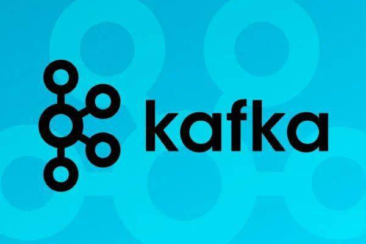

从Kafka诞生的早期，我就对Kafka投入了很多的关注，虽然不敢说精通Kafka, 但也算是非常熟悉了。

平时在工作之中，几乎天天都在跟这玩意儿打交道，在面试的时候，也会经常聊一些Kafka相关的内容。

Kafka 是一个优秀的分布式消息中间件，许多系统中都会使用到 Kafka 来做消息通信。对分布式消息系统的了解和使用几乎成为一个开发人员必备的技能。

我写过很多Kafka的内容，也在不断优化迭代，今天来分享一篇硬核的文章。

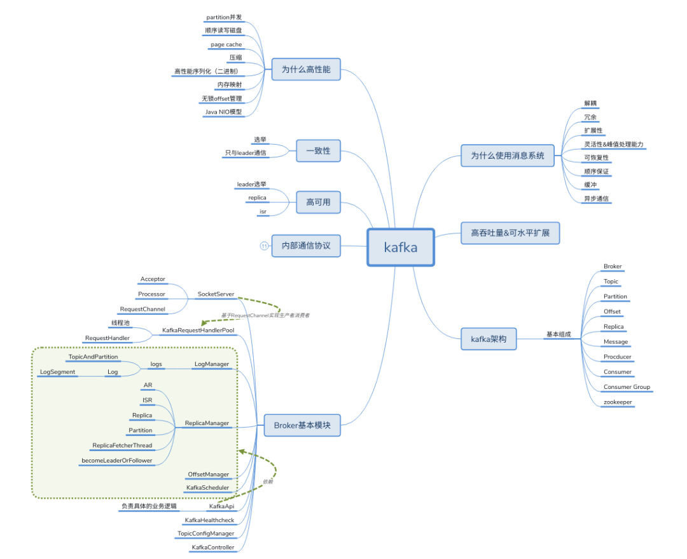

思维导图讲一讲分布式消息中间件问题

- 什么是分布式消息中间件？
- 消息中间件的作用是什么？
- 消息中间件的使用场景是什么？
- 消息中间件选型？

消息队列

分布式消息是一种通信机制，和 RPC、HTTP、RMI 等不一样，消息中间件采用分布式中间代理的方式进行通信。如图所示，采用了消息中间件之后，上游业务系统发送消息，先存储在消息中间件，然后由消息中间件将消息分发到对应的业务模块应用（分布式生产者 - 消费者模式）。这种异步的方式，减少了服务之间的耦合程度。

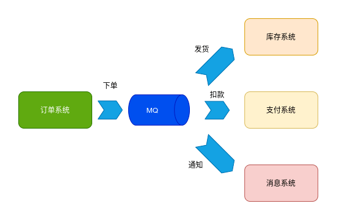

架构

**定义消息中间件：**

- 利用高效可靠的消息传递机制进行平台无关的数据交流
- 基于数据通信，来进行分布式系统的集成
- 通过提供消息传递和消息排队模型，可以在分布式环境下扩展进程间的通信

在系统架构中引用额外的组件，必然提高系统的架构复杂度和运维的难度，那么 **在系统中使用分布式消息中间件有什么优势呢？消息中间件在系统中起的作用又是什么呢？**

- 解耦
- 冗余（存储）
- 扩展性
- 削峰
- 可恢复性
- 顺序保证
- 缓冲
- 异步通信

**下面是常见的几种分布式消息系统的对比：**

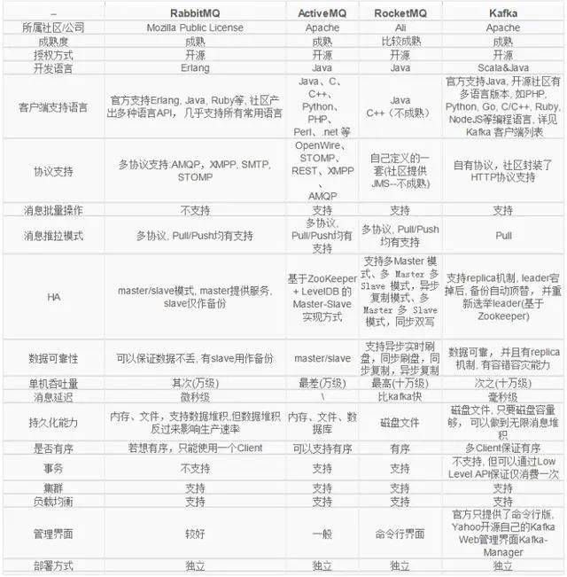

选择答案关键字

- 什么是分布式消息中间件？通信，队列，分布式，生产消费者模式。
- 消息中间件的作用是什么？解耦、峰值处理、异步通信、缓冲。
- 消息中间件的使用场景是什么？异步通信，消息存储处理。
- 消息中间件选型？语言，协议、HA、数据可靠性、性能、事务、生态、简易、推拉模式。

Kafka 基本概念和架构 问题

- 简单讲下 Kafka 的架构？
- Kafka 是推模式还是拉模式，推拉的区别是什么？
- Kafka 如何广播消息？
- Kafka 的消息是否是有序的？
- Kafka 是否支持读写分离？
- Kafka 如何保证数据高可用？
- Kafka 中 zookeeper 的作用？
- 是否支持事务？
- 分区数是否可以减少？

**Kafka 架构中的一般概念：**

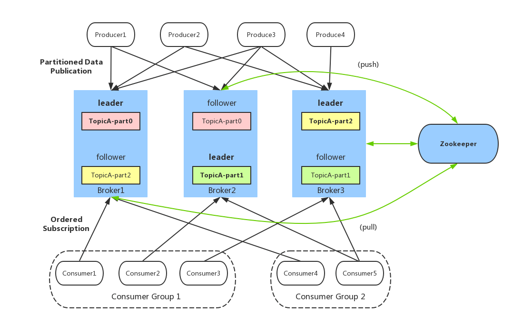

架构

- Producer：生产者，也就是发送消息的一方。生产者负责创建消息，然后将其发送到 Kafka。
- Consumer：消费者，也就是接受消息的一方。消费者连接到 Kafka 上并接收消息，进而进行相应的业务逻辑处理。
- Consumer Group：一个消费者组可以包含一个或多个消费者。使用多分区 + 多消费者方式可以极大提高数据下游的处理速度，同一消费组中的消费者不会重复消费消息，同样的，不同消费组中的消费者消息消息时互不影响。Kafka 就是通过消费组的方式来实现消息 P2P 模式和广播模式。
- Broker：服务代理节点。Broker 是 Kafka 的服务节点，即 Kafka 的服务器。
- 
- Partition：Topic 是一个逻辑的概念，它可以细分为多个分区，每个分区只属于单个主题。同一个主题下不同分区包含的消息是不同的，分区在存储层面可以看作一个可追加的日志（Log）文件，消息在被追加到分区日志文件的时候都会分配一个特定的偏移量（offset）。
- Offset：offset 是消息在分区中的唯一标识，Kafka 通过它来保证消息在分区内的顺序性，不过 offset 并不跨越分区，也就是说，Kafka 保证的是分区有序性而不是主题有序性。
- Replication：副本，是 Kafka 保证数据高可用的方式，Kafka 同一 Partition 的数据可以在多 Broker 上存在多个副本，通常只有主副本对外提供读写服务，当主副本所在 broker 崩溃或发生网络一场，Kafka 会在 Controller 的管理下会重新选择新的 Leader 副本对外提供读写服务。
- Record：实际写入 Kafka 中并可以被读取的消息记录。每个 record 包含了 key、value 和 timestamp。

**Kafka Topic Partitions Layout**

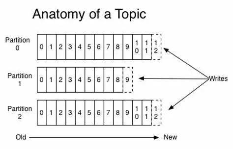

主题

Kafka 将 Topic 进行分区，分区可以并发读写。

**Kafka Consumer Offset**

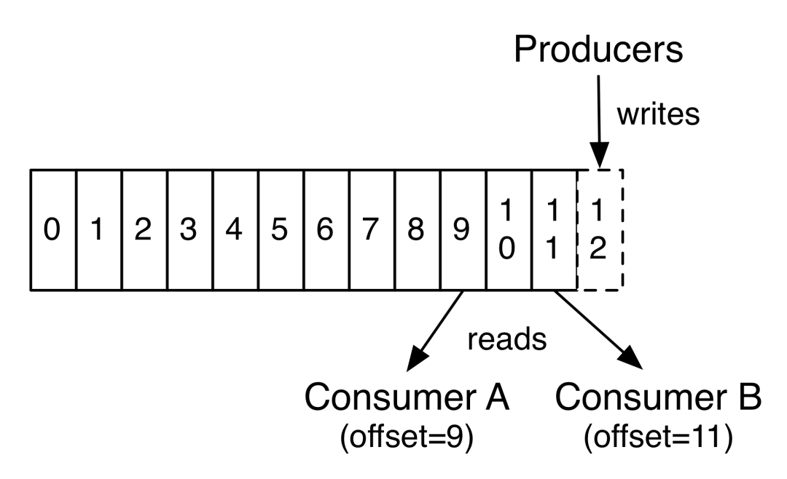

consumer offsetzookeeper

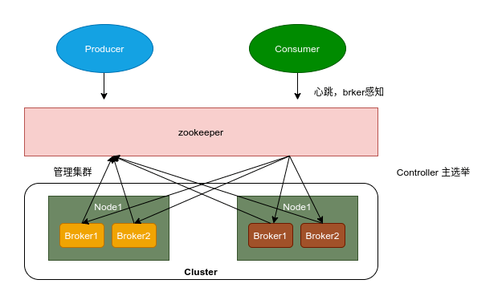

zookeeper

- Broker 注册：Broker 是分布式部署并且之间相互独立，Zookeeper 用来管理注册到集群的所有 Broker 节点。
- Topic 注册：在 Kafka 中，同一个 Topic 的消息会被分成多个分区并将其分布在多个 Broker 上，这些分区信息及与 Broker 的对应关系也都是由 Zookeeper 在维护
- 生产者负载均衡：由于同一个 Topic 消息会被分区并将其分布在多个 Broker 上，因此，生产者需要将消息合理地发送到这些分布式的 Broker 上。
- 消费者负载均衡：与生产者类似，Kafka 中的消费者同样需要进行负载均衡来实现多个消费者合理地从对应的 Broker 服务器上接收消息，每个消费者分组包含若干消费者，每条消息都只会发送给分组中的一个消费者，不同的消费者分组消费自己特定的 Topic 下面的消息，互不干扰。

答案关键字

- 简单讲下 Kafka 的架构？

  > Producer、Consumer、Consumer Group、Topic、Partition

- Kafka 是推模式还是拉模式，推拉的区别是什么？

  > Kafka Producer 向 Broker 发送消息使用 Push 模式，Consumer 消费采用的 Pull 模式。拉取模式，让 consumer 自己管理 offset，可以提供读取性能

- Kafka 如何广播消息？

  > Consumer group

- Kafka 的消息是否是有序的？

  > Topic 级别无序，Partition 有序

- Kafka 是否支持读写分离？

  > 不支持，只有 Leader 对外提供读写服务

- Kafka 如何保证数据高可用？

  > 副本，ack，HW

- Kafka 中 zookeeper 的作用？

  > 集群管理，元数据管理

- 是否支持事务？

  > 0.11 后支持事务，可以实现”exactly once“

- 分区数是否可以减少？

  > 不可以，会丢失数据

Kafka 使用 问题

- Kafka 有哪些命令行工具？你用过哪些？
- Kafka Producer 的执行过程？
- Kafka Producer 有哪些常见配置？
- 如何让 Kafka 的消息有序？
- Producer 如何保证数据发送不丢失？
- 如何提升 Producer 的性能？
- 如果同一 group 下 consumer 的数量大于 part 的数量，kafka 如何处理？
- Kafka Consumer 是否是线程安全的？
- 讲一下你使用 Kafka Consumer 消费消息时的线程模型，为何如此设计？
- Kafka Consumer 的常见配置？
- Consumer 什么时候会被踢出集群？
- 当有 Consumer 加入或退出时，Kafka 会作何反应？
- 什么是 Rebalance，何时会发生 Rebalance？

命令行工具

Kafka 的命令行工具在 Kafka 包的/bin目录下，主要包括服务和集群管理脚本，配置脚本，信息查看脚本，Topic 脚本，客户端脚本等。

- kafka-configs.sh：配置管理脚本
- kafka-console-consumer.sh：kafka 消费者控制台
- kafka-console-producer.sh：kafka 生产者控制台
- kafka-consumer-groups.sh：kafka 消费者组相关信息
- kafka-delete-records.sh：删除低水位的日志文件
- kafka-log-dirs.sh：kafka 消息日志目录信息
- kafka-mirror-maker.sh：不同数据中心 kafka 集群复制工具
- kafka-preferred-replica-election.sh：触发 preferred replica 选举
- kafka-producer-perf-test.sh：kafka 生产者性能测试脚本
- kafka-reassign-partitions.sh：分区重分配脚本
- kafka-replica-verification.sh：复制进度验证脚本
- kafka-server-start.sh：启动 kafka 服务
- kafka-server-stop.sh：停止 kafka 服务
- kafka-topics.sh：topic 管理脚本
- kafka-verifiable-consumer.sh：可检验的 kafka 消费者
- kafka-verifiable-producer.sh：可检验的 kafka 生产者
- zookeeper-server-start.sh：启动 zk 服务
- zookeeper-server-stop.sh：停止 zk 服务
- zookeeper-shell.sh：zk 客户端

我们通常可以使用kafka-console-consumer.sh和kafka-console-producer.sh脚本来测试 Kafka 生产和消费，kafka-consumer-groups.sh可以查看和管理集群中的 Topic，kafka-topics.sh通常用于查看 Kafka 的消费组情况。

Kafka Producer

Kafka producer 的正常生产逻辑包含以下几个步骤：

1. 配置生产者客户端参数常见生产者实例。
2. 构建待发送的消息。
3. 发送消息。
4. 关闭生产者实例。

Producer 发送消息的过程如下图所示，需要经过拦截器，序列化器和分区器，最终由累加器批量发送至 Broker。

producer

Kafka Producer 需要以下必要参数：

- bootstrap.server：指定 Kafka 的 Broker 的地址
- key.serializer：key 序列化器
- value.serializer：value 序列化器

常见参数：

- batch.num.messages

  > 默认值：200，每次批量消息的数量，只对 asyc 起作用。

- request.required.acks

  > 默认值：0，0 表示 producer 毋须等待 leader 的确认，1 代表需要 leader 确认写入它的本地 log 并立即确认，-1 代表所有的备份都完成后确认。只对 async 模式起作用，这个参数的调整是数据不丢失和发送效率的 tradeoff，如果对数据丢失不敏感而在乎效率的场景可以考虑设置为 0，这样可以大大提高 producer 发送数据的效率。

- request.timeout.ms

  > 默认值：10000，确认超时时间。

- partitioner.class

  > 默认值：kafka.producer.DefaultPartitioner，必须实现 kafka.producer.Partitioner，根据 Key 提供一个分区策略。 有时候我们需要相同类型的消息必须顺序处理，这样我们就必须自定义分配策略，从而将相同类型的数据分配到同一个分区中。

- producer.type

  > 默认值：sync，指定消息发送是同步还是异步。异步 asyc 成批发送用 kafka.producer.AyncProducer， 同步 sync 用 kafka.producer.SyncProducer。同步和异步发送也会影响消息生产的效率。

- compression.topic

  > 默认值：none，消息压缩，默认不压缩。其余压缩方式还有，"gzip"、"snappy"和"lz4"。对消息的压缩可以极大地减少网络传输量、降低网络 IO，从而提高整体性能。

- compressed.topics

  > 默认值：null，在设置了压缩的情况下，可以指定特定的 topic 压缩，未指定则全部压缩。

- message.send.max.retries

  > 默认值：3，消息发送最大尝试次数。

- retry.backoff.ms

  > 默认值：300，每次尝试增加的额外的间隔时间。

- topic.metadata.refresh.interval.ms

  > 

- queue.buffering.max.ms

  > 默认值：5000，在 producer queue 的缓存的数据最大时间，仅仅 for asyc。

- queue.buffering.max.message

  > 默认值：10000，producer 缓存的消息的最大数量，仅仅 for asyc。

- queue.enqueue.timeout.ms

  > 默认值：-1，0 当 queue 满时丢掉，负值是 queue 满时 block, 正值是 queue 满时 block 相应的时间，仅仅 for asyc。

Kafka Consumer

Kafka 有消费组的概念，每个消费者只能消费所分配到的分区的消息，每一个分区只能被一个消费组中的一个消费者所消费，所以同一个消费组中消费者的数量如果超过了分区的数量，将会出现有些消费者分配不到消费的分区。

Kafka Consumer Client 消费消息通常包含以下步骤：

1. 配置客户端，创建消费者
2. 
3. 拉去消息并消费
4. 提交消费位移
5. 关闭消费者实例

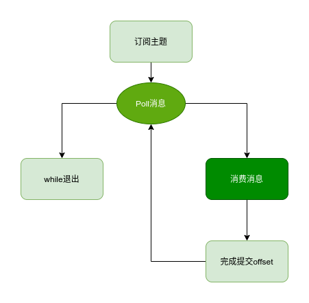

过程

因为 Kafka 的 Consumer 客户端是线程不安全的，为了保证线程安全，并提升消费性能，可以在 Consumer 端采用类似 Reactor 的线程模型来消费数据。

消费模型Kafka consumer 参数

- bootstrap.servers：连接 broker 地址， host：port 格式。
- group.id：消费者隶属的消费组。
- key.deserializer：与生产者的 key.serializer 对应，key 的反序列化方式。
- value.deserializer：与生产者的 value.serializer 对应，value 的反序列化方式。
- session.timeout.ms：coordinator 检测失败的时间。默认 10s 该参数是 Consumer Group 主动检测 （组内成员 comsummer) 崩溃的时间间隔，类似于心跳过期时间。
- auto.offset.reset：该属性指定了消费者在读取一个没有偏移量后者偏移量无效（消费者长时间失效当前的偏移量已经过时并且被删除了）的分区的情况下，应该作何处理，默认值是 latest，也就是从最新记录读取数据（消费者启动之后生成的记录），另一个值是 earliest，意思是在偏移量无效的情况下，消费者从起始位置开始读取数据。
- enable.auto.commit：否自动提交位移，如果为 false ，则需要在程序中手动提交位移。对于精确到一次的语义，最好手动提交位移
- fetch.max.bytes：单次拉取数据的最大字节数量
- max.poll.records：单次 poll 调用返回的最大消息数，如果处理逻辑很轻量，可以适当提高该值。但是 max.poll.records 条数据需要在在 session.timeout.ms 这个时间内处理完 。默认值为 500
- request.timeout.ms：一次请求响应的最长等待时间。如果在超时时间内未得到响应，kafka 要么重发这条消息，要么超过重试次数的情况下直接置为失败。

Kafka Rebalance

**什么时候 rebalance？**

这也是经常被提及的一个问题。rebalance 的触发条件有三种：

- 组成员发生变更（新 consumer 加入组、已有 consumer 主动离开组或已有 consumer 崩溃了——这两者的区别后面会谈到）
- 
- 

**如何进行组内分区分配？**

Kafka 默认提供了两种分配策略：Range 和 Round-Robin。当然 Kafka 采用了可插拔式的分配策略，你可以创建自己的分配器以实现不同的分配策略。

答案关键字

- Kafka 有哪些命令行工具？你用过哪些？ /bin 目录，管理 kafka 集群、管理 topic、生产和消费 kafka
- Kafka Producer 的执行过程？拦截器，序列化器，分区器和累加器
- Kafka Producer 有哪些常见配置？broker 配置，ack 配置，网络和发送参数，压缩参数，ack 参数
- 如何让 Kafka 的消息有序？Kafka 在 Topic 级别本身是无序的，只有 partition 上才有序，所以为了保证处理顺序，可以自定义分区器，将需顺序处理的数据发送到同一个 partition
- Producer 如何保证数据发送不丢失？ack 机制，重试机制
- 如何提升 Producer 的性能？批量，异步，压缩
- 如果同一 group 下 consumer 的数量大于 part 的数量，kafka 如何处理？多余的 Part 将处于无用状态，不消费数据
- Kafka Consumer 是否是线程安全的？不安全，单线程消费，多线程处理
- 讲一下你使用 Kafka Consumer 消费消息时的线程模型，为何如此设计？拉取和处理分离
- Kafka Consumer 的常见配置？broker, 网络和拉取参数，心跳参数
- Consumer 什么时候会被踢出集群？奔溃，网络异常，处理时间过长提交位移超时
- 当有 Consumer 加入或退出时，Kafka 会作何反应？进行 Rebalance
- 什么是 Rebalance，何时会发生 Rebalance？topic 变化，consumer 变化

高可用和性能 问题

- Kafka 如何保证高可用？
- Kafka 的交付语义？
- Replic 的作用？
- 什么事 AR，ISR？
- Leader 和 Flower 是什么？
- Kafka 中的 HW、LEO、LSO、LW 等分别代表什么？
- Kafka 为保证优越的性能做了哪些处理？

分区与副本

在分布式数据系统中，通常使用分区来提高系统的处理能力，通过副本来保证数据的高可用性。多分区意味着并发处理的能力，这多个副本中，只有一个是 leader，而其他的都是 follower 副本。仅有 leader 副本可以对外提供服务。多个 follower 副本通常存放在和 leader 副本不同的 broker 中。通过这样的机制实现了高可用，当某台机器挂掉后，其他 follower 副本也能迅速”转正“，开始对外提供服务。

**为什么 follower 副本不提供读服务？**

这个问题本质上是对性能和一致性的取舍。试想一下，如果 follower 副本也对外提供服务那会怎么样呢？首先，性能是肯定会有所提升的。但同时，会出现一系列问题。类似数据库事务中的幻读，脏读。比如你现在写入一条数据到 kafka 主题 a，消费者 b 从主题 a 消费数据，却发现消费不到，因为消费者 b 去读取的那个分区副本中，最新消息还没写入。而这个时候，另一个消费者 c 却可以消费到最新那条数据，因为它消费了 leader 副本。Kafka 通过 WH 和 Offset 的管理来决定 Consumer 可以消费哪些数据，已经当前写入的数据。

watermark

**只有 Leader 可以对外提供读服务，那如何选举 Leader**

kafka 会将与 leader 副本保持同步的副本放到 ISR 副本集合中。当然，leader 副本是一直存在于 ISR 副本集合中的，在某些特殊情况下，ISR 副本中甚至只有 leader 一个副本。当 leader 挂掉时，kakfa 通过 zookeeper 感知到这一情况，在 ISR 副本中选取新的副本成为 leader，对外提供服务。但这样还有一个问题，前面提到过，有可能 ISR 副本集合中，只有 leader，当 leader 副本挂掉后，ISR 集合就为空，这时候怎么办呢？这时候如果设置 unclean.leader.election.enable 参数为 true，那么 kafka 会在非同步，也就是不在 ISR 副本集合中的副本中，选取出副本成为 leader。

**副本的存在就会出现副本同步问题**

Kafka 在所有分配的副本 (AR) 中维护一个可用的副本列表 (ISR)，Producer 向 Broker 发送消息时会根据ack配置来确定需要等待几个副本已经同步了消息才相应成功，Broker 内部会ReplicaManager服务来管理 flower 与 leader 之间的数据同步。

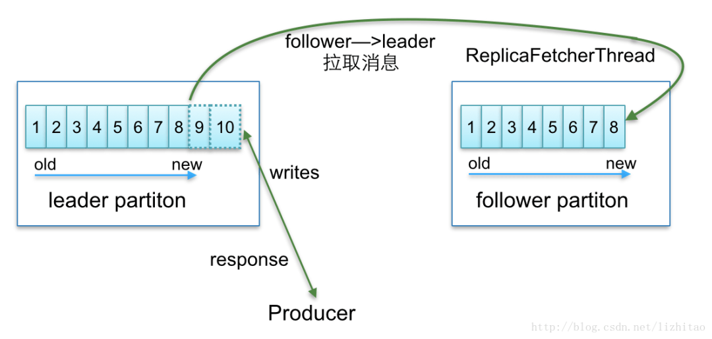

sync性能优化

- partition 并发
- 顺序读写磁盘
- page cache：按页读写
- 预读：Kafka 会将将要消费的消息提前读入内存
- 高性能序列化（二进制）
- 内存映射
- 无锁 offset 管理：提高并发能力
- Java NIO 模型
- 批量：批量读写
- 压缩：消息压缩，存储压缩，减小网络和 IO 开销

Partition 并发

一方面，由于不同 Partition 可位于不同机器，因此可以充分利用集群优势，实现机器间的并行处理。另一方面，由于 Partition 在物理上对应一个文件夹，即使多个 Partition 位于同一个节点，也可通过配置让同一节点上的不同 Partition 置于不同的 disk drive 上，从而实现磁盘间的并行处理，充分发挥多磁盘的优势。

顺序读写

Kafka 每一个 partition 目录下的文件被平均切割成大小相等（默认一个文件是 500 兆，可以手动去设置）的数据文件， 每一个数据文件都被称为一个段（segment file）, 每个 segment 都采用 append 的方式追加数据。

追加数据答案关键字

- Kafka 如何保证高可用？

  > 通过副本来保证数据的高可用，producer ack、重试、自动 Leader 选举，Consumer 自平衡

- Kafka 的交付语义？

  > 交付语义一般有at least once、at most once和exactly once。kafka 通过 ack 的配置来实现前两种。

- Replic 的作用？

  > 实现数据的高可用

- 什么是 AR，ISR？

  > AR：Assigned Replicas。AR 是主题被创建后，分区创建时被分配的副本集合，副本个 数由副本因子决定。ISR：In-Sync Replicas。Kafka 中特别重要的概念，指代的是 AR 中那些与 Leader 保 持同步的副本集合。在 AR 中的副本可能不在 ISR 中，但 Leader 副本天然就包含在 ISR 中。关于 ISR，还有一个常见的面试题目是如何判断副本是否应该属于 ISR。目前的判断 依据是：Follower 副本的 LEO 落后 Leader LEO 的时间，是否超过了 Broker 端参数 replica.lag.time.max.ms 值。如果超过了，副本就会被从 ISR 中移除。

- Leader 和 Flower 是什么？

- Kafka 中的 HW 代表什么？

  > 高水位值 (High watermark)。这是控制消费者可读取消息范围的重要字段。一 个普通消费者只能“看到”Leader 副本上介于 Log Start Offset 和 HW（不含）之间的 所有消息。水位以上的消息是对消费者不可见的。

- Kafka 为保证优越的性能做了哪些处理？

  > partition 并发、顺序读写磁盘、page cache 压缩、高性能序列化（二进制）、内存映射 无锁 offset 管理、Java NIO 模型

建议读者同学结合 Kafka 的配置去了解 Kafka 的实现原理，Kafka 有大量的配置，这也是 Kafka 高度扩展的一个表现，很多同学对 Kafka 的配置也不敢轻易改动。所以理解这些配置背后的实现原理，可以让我们在实践中懂得如何使用和优化 Kafka。既可面试造火箭，也可以实战造火箭。

Kafka 配置说明链接：https://kafka.apache.org/documentation

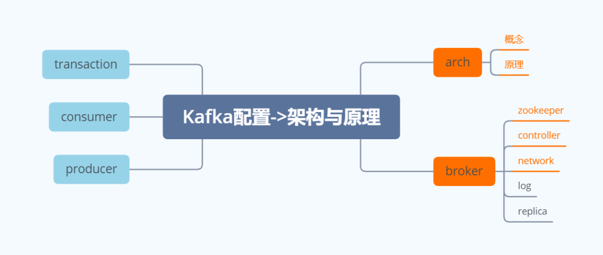

Architecture

理解 Kafka 架构，就是理解 Kafka 的各种组件的概念，以及这些组件的关系。先简单看一下各组件及其简单说明。

不要去尝试记忆他们

我们理解了也就自然记住了

我们应该通过理解的方式去记忆它们。

生产者-消费者

生产者-消费者是一种设计模式，生产者和消费者之间通过添加一个中间组件来达到解耦。生产者向中间组件生成数据，消费者消费数据。

就像读书时 65 哥给小芳写情书，这里写情书就是 生产者，情书就是消息，小芳就是消费者。但有时候小芳不在，或者比较忙，65 哥也比较害羞，不敢直接将情书塞小芳手里，于是将情书塞在小芳抽屉中。所以抽屉就是这个中间组件。

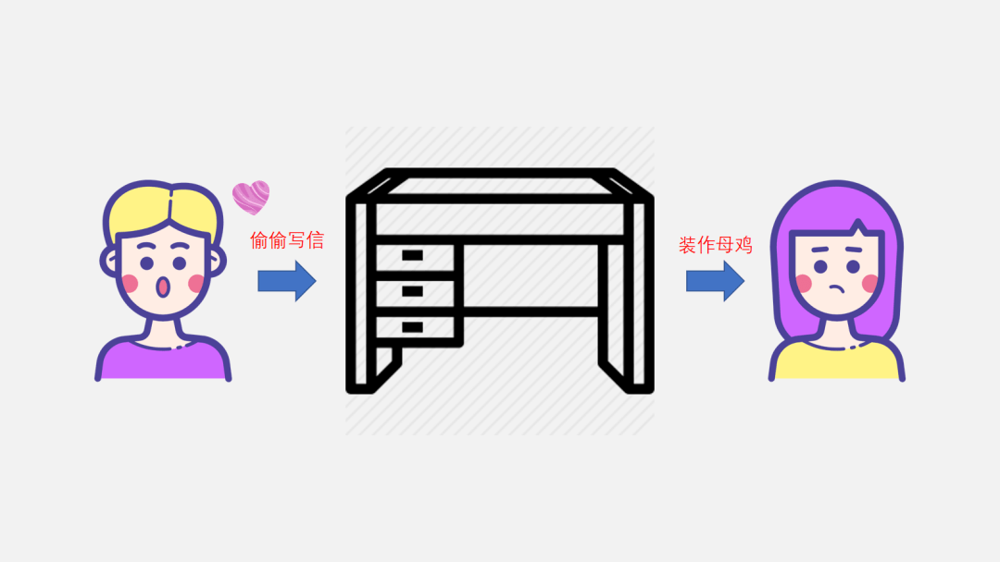

在程序中我们通常使用Queue来作为这个中间组件。可以使用多线程向队列中写入数据，另外的消费者线程依次读取队列中的数据进行消费。模型如下图所示：

生产者-消费者模式通过添加一个中间层，不仅可以解耦生产者和消费者，使其易于扩展，还可以异步化调用、缓冲消息等。

分布式队列

后来 65 哥和小芳异地了，65 哥在卷都奋斗，小芳在魔都逛街。于是只能通过邮局寄暧昧信了。这样 65 哥、邮局和小芳就成了分布式的了。65 哥将信件发给邮局，小芳从邮局拿到 65 哥写的信，再回去慢慢看。

Kafka 的消息生产者就是Producer，上游消费者进程添加 Kafka Client 创建 Kafka Producer，向 Broker 发送消息，Broker 是集群部署在远程服务器上的 Kafka Server 进程，下游消费者进程引入 Kafka Consumer API 持续消费队列中消息。

因为 Kafka Consumer 使用 Poll 的模式，需要 Consumer 主动拉去消息。所有小芳只能定期去邮局拿信件了(呃，果然主动权都在小芳手上啊)。

主题

邮局不能只为 65 哥服务，虽然 65 哥一天写好几封信。但也无法挽回邮局的损失。所以邮局是可以供任何人寄信。只需要寄信人写好地址(主题)，邮局建有两地的通道就可以发收信件了。

Kafka 的 Topic 才相当于一个队列，Broker 是所有队列部署的机器。可以按业务创建不同的 Topic，Producer 向所属业务的 Topic 发送消息，相应的 Consumer 可以消费并处理消息。

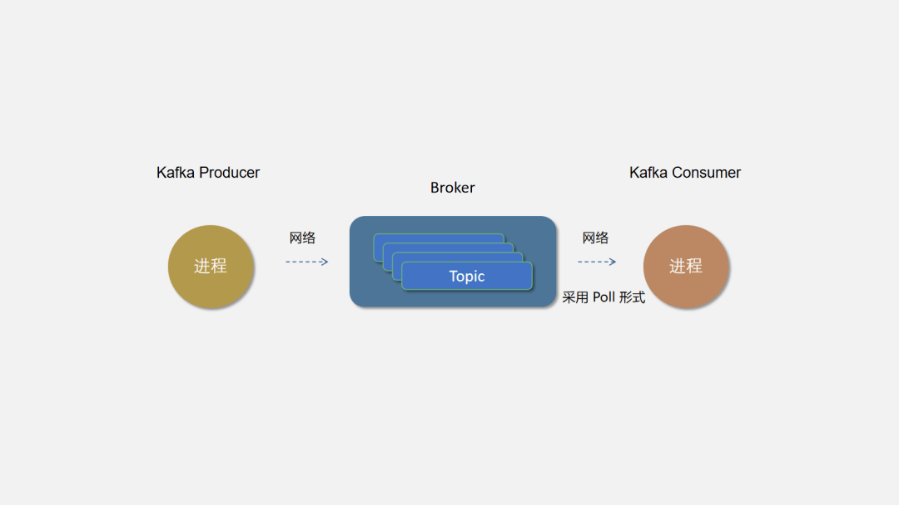

分区

由于 65 哥写的信太多，一个邮局已经无法满足 65 哥的需求，邮政公司只能多建几个邮局了，65 哥将信件按私密度分类(分区策略)，从不同的邮局寄送。

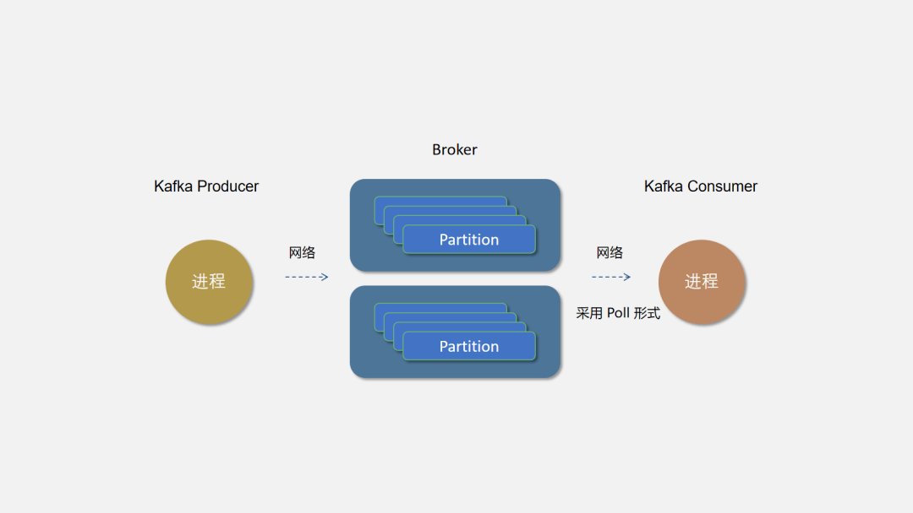

同一个 Topic 可以创建多个分区。理论上分区越多并发度越高，Kafka 会根据分区策略将分区尽可能均衡的分布在不同的 Broker 节点上，以避免消息倾斜，不同的 Broker 负载差异太大。分区也不是越多越好哦，毕竟太多邮政公司也管理不过来。

副本

为防止由于邮局的问题，比如交通断啦，邮车没油啦。导致 65 哥的暧昧信无法寄到小芳手上，使得 65 哥晚上远程跪键盘。邮局决定将 65 哥的信件复制几份发到多个正常的邮局，这样只要有一个邮局还在，小芳就可以收到 65 哥的信了。

Kafka 采用分区副本的方式来保证数据的高可用，每个分区都将建立指定数量的副本数，kakfa 保证同一分区副本尽量分布在不同的 Broker 节点上，以防止 Broker 宕机导致所有副本不可用。Kafka 会为分区的多个副本选举一个作为主副本(Leader)，主副本对外提供读写服务，从副本(Follower)实时同步 Leader 的数据。

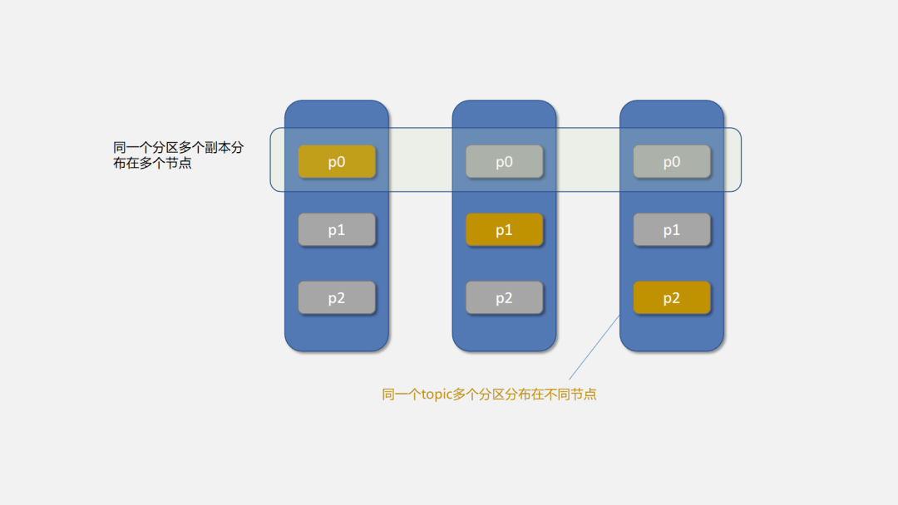

多消费者

哎，65 哥的信件满天飞，小芳天天跑邮局，还要一一拆开看，65 哥写的信又臭又长，让小芳忙得满身 大汉大汗。于是小芳啪的一下，很快啊，变出多个分身去不同的邮局取信，这样小芳终于可以挤出额外的时间逛街了。

广播消息

邮局最近提供了定制明信片业务，每个人都可以设计明信片，同一个身份只能领取一种明信片。65 哥设计了一堆，广播给所有漂亮的小妹妹都可以来领取，美女啪变出的分身也可以来领取，但是同一个身份的多个分身只能取一种明信片。

最后我们完成了 Kafka 的整体架构，如下：

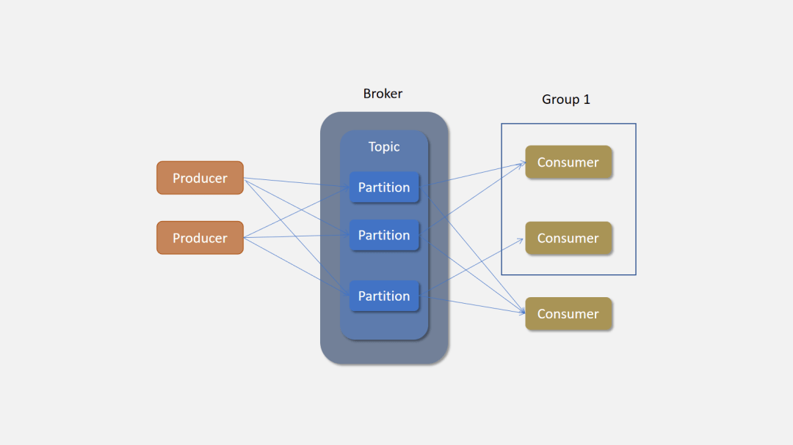

Zookeeper

Zookeeper 是一个成熟的分布式协调服务，它可以为分布式服务提供分布式配置服、同步服务和命名注册等能力.。对于任何分布式系统，都需要一种协调任务的方法。Kafka 是使用 ZooKeeper 而构建的分布式系统。但是也有一些其他技术（例如 Elasticsearch 和 MongoDB）具有其自己的内置任务协调机制。

Kafka 将 Broker、Topic 和 Partition 的元数据信息存储在 Zookeeper 上。通过在 Zookeeper 上建立相应的数据节点，并监听节点的变化，Kafka 使用 Zookeeper 完成以下功能：

- Kafka Controller 的 Leader 选举
- Kafka 集群成员管理
- Topic 配置管理
- 分区副本管理

我们看一看 Zookeeper 下 Kafka 创建的节点，即可一目了然的看出这些相关的功能。

Controller

Controller 是从 Broker 中选举出来的，负责分区 Leader 和 Follower 的管理。当某个分区的 leader 副本发生故障时，由 Controller 负责为该分区选举新的 leader 副本。当检测到某个分区的 ISR(In-Sync Replica)集合发生变化时，由控制器负责通知所有 broker 更新其元数据信息。当使用kafka-topics.sh脚本为某个 topic 增加分区数量时，同样还是由控制器负责分区的重新分配。

Kafka 中 Contorller 的选举的工作依赖于 Zookeeper，成功竞选为控制器的 broker 会在 Zookeeper 中创建/controller这个临时（EPHEMERAL）节点。

选举过程

Broker 启动的时候尝试去读取/controller节点的brokerid的值，如果brokerid的值不等于-1，则表明已经有其他的 Broker 成功成为 Controller 节点，当前 Broker 主动放弃竞选；如果不存在/controller节点，或者 brokerid 数值异常，当前 Broker 尝试去创建/controller这个节点。

此时也有可能其他 broker 同时去尝试创建这个节点，只有创建成功的那个 broker 才会成为控制器，而创建失败的 broker 则表示竞选失败。每个 broker 都会在内存中保存当前控制器的 brokerid 值，这个值可以标识为 activeControllerId。

实现

Controller 读取 Zookeeper 中的节点数据，初始化上下文(Controller Context)，并管理节点变化，变更上下文，同时也需要将这些变更信息同步到其他普通的 broker 节点中。Controller 通过定时任务，或者监听器模式获取 zookeeper 信息，事件监听会更新更新上下文信息。

如图所示，Controller 内部也采用生产者-消费者实现模式，Controller 将 zookeeper 的变动通过事件的方式发送给事件队列，队列就是一个LinkedBlockingQueue，事件消费者线程组通过消费消费事件，将相应的事件同步到各 Broker 节点。这种队列 FIFO 的模式保证了消息的有序性。

职责

Controller 被选举出来，作为整个 Broker 集群的管理者，管理所有的集群信息和元数据信息。它的职责包括下面几部分：

1. 处理 Broker 节点的上线和下线，包括自然下线、宕机和网络不可达导致的集群变动，Controller 需要及时更新集群元数据，并将集群变化通知到所有的 Broker 集群节点；
2. 创建 Topic 或者 Topic 扩容分区，Controller 需要负责分区副本的分配工作，并主导 Topic 分区副本的 Leader 选举。
3. 管理集群中所有的副本和分区的状态机，监听状态机变化事件，并作出相应的处理。Kafka 分区和副本数据采用状态机的方式管理，分区和副本的变化都在状态机内会引起状态机状态的变更，从而触发相应的变化事件。

> “
>
> 状态机啊，听起来好复杂。
>
> ”

Controller 管理着集群中所有副本和分区的状态机。大家不要被状态机这个词唬住了。理解状态机很简单。先理解模型，即这是什么关于什么模型，然后就是模型的状态有哪些，模型状态之间如何转换，转换时发送相应的变化事件。

Kafka 的分区和副本状态机很简单。我们先理解，这分别是管理 Kafka Topic 的分区和副本的。它们的状态也很简单，就是 CRUD，具体说来如下：

分区状态机

PartitionStateChange，管理 Topic 的分区，它有以下 4 种状态：

1. NonExistentPartition：该状态表示分区没有被创建过或创建后被删除了。
2. NewPartition：分区刚创建后，处于这个状态。此状态下分区已经分配了副本，但是还没有选举 leader，也没有 ISR 列表。
3. OnlinePartition：一旦这个分区的 leader 被选举出来，将处于这个状态。
4. OfflinePartition：当分区的 leader 宕机，转移到这个状态。

我们用一张图来直观的看看这些状态是如何变化的，以及在状态发生变化时 Controller 都有哪些操作：

副本状态机

ReplicaStateChange，副本状态，管理分区副本信息，它也有 4 种状态：

1. NewReplica: 创建 topic 和分区分配后创建 replicas，此时，replica 只能获取到成为 follower 状态变化请求。
2. OnlineReplica: 当 replica 成为 parition 的 assingned replicas 时，其状态变为 OnlineReplica, 即一个有效的 OnlineReplica。
3. OfflineReplica: 当一个 replica 下线，进入此状态，这一般发生在 broker 宕机的情况下；
4. NonExistentReplica: Replica 成功删除后，replica 进入 NonExistentReplica 状态。

副本状态间的变化如下图所示，Controller 在状态变化时会做出相应的操作：

Network

Kafka 的网络通信模型是基于 NIO 的 Reactor 多线程模型来设计的。其中包含了一个Acceptor线程，用于处理新的连接，Acceptor有 N 个 Processor线程 select 和 read socket 请求，N 个 Handler线程处理请求并相应，即处理业务逻辑。

Kafka 性能全景

从高度抽象的角度来看，性能问题逃不出下面三个方面：

- 网络
- 磁盘
- 复杂度

对于 Kafka 这种网络分布式队列来说，网络和磁盘更是优化的重中之重。针对于上面提出的抽象问题，解决方案高度抽象出来也很简单：

- 并发
- 压缩
- 批量
- 缓存
- 算法

知道了问题和思路，我们再来看看，在 Kafka 中，有哪些角色，而这些角色就是可以优化的点：

- Producer
- Broker
- Consumer

是的，所有的问题，思路，优化点都已经列出来了，我们可以尽可能的细化，三个方向都可以细化，如此，所有的实现便一目了然，即使不看 Kafka 的实现，我们自己也可以想到一二点可以优化的地方。

这就是思考方式。提出问题> 列出问题点> 列出优化方法> 列出具体可切入的点> tradeoff和细化实现。

现在，你也可以尝试自己想一想优化的点和方法，不用尽善尽美，不用管好不好实现，想一点是一点。

> “
>
> 不行啊，我很笨，也很懒，你还是直接和我说吧，我白嫖比较行。
>
> ”

顺序写

> “
>
> 人家 Redis 是基于纯内存的系统，你 kafka 还要读写磁盘，能比？
>
> ”

为什么说写磁盘慢？

我们不能只知道结论，而不知其所以然。要回答这个问题，就得回到在校时我们学的操作系统课程了。来，翻到讲磁盘的章节，让我们回顾一下磁盘的运行原理。

> “
>
> 鬼还留着哦，课程还没上到一半书就没了。要不是考试俺眼神好，估计现在还没毕业。
>
> ”

完成一次磁盘 IO，需要经过寻道、旋转和数据传输三个步骤。

影响磁盘 IO 性能的因素也就发生在上面三个步骤上，因此主要花费的时间就是：

1. 寻道时间：Tseek 是指将读写磁头移动至正确的磁道上所需要的时间。寻道时间越短，I/O 操作越快，目前磁盘的平均寻道时间一般在 3-15ms。
2. 旋转延迟：Trotation 是指盘片旋转将请求数据所在的扇区移动到读写磁盘下方所需要的时间。旋转延迟取决于磁盘转速，通常用磁盘旋转一周所需时间的 1/2 表示。比如：7200rpm 的磁盘平均旋转延迟大约为 60*1000/7200/2 = 4.17ms，而转速为 15000rpm 的磁盘其平均旋转延迟为 2ms。
3. 数据传输时间：Ttransfer 是指完成传输所请求的数据所需要的时间，它取决于数据传输率，其值等于数据大小除以数据传输率。目前 IDE/ATA 能达到 133MB/s，SATA II 可达到 300MB/s 的接口数据传输率，数据传输时间通常远小于前两部分消耗时间。简单计算时可忽略。

因此，如果在写磁盘的时候省去寻道、旋转可以极大地提高磁盘读写的性能。

Kafka 采用顺序写文件的方式来提高磁盘写入性能。顺序写文件，基本减少了磁盘寻道和旋转的次数。磁头再也不用在磁道上乱舞了，而是一路向前飞速前行。

Kafka 中每个分区是一个有序的，不可变的消息序列，新的消息不断追加到 Partition 的末尾，在 Kafka 中 Partition 只是一个逻辑概念，Kafka 将 Partition 划分为多个 Segment，每个 Segment 对应一个物理文件，Kafka 对 segment 文件追加写，这就是顺序写文件。

> “
>
> 为什么 Kafka 可以使用追加写的方式呢？
>
> ”

这和 Kafka 的性质有关，我们来看看 Kafka 和 Redis，说白了，Kafka 就是一个Queue，而 Redis 就是一个HashMap。Queue和Map的区别是什么？

Queue是 FIFO 的，数据是有序的；HashMap数据是无序的，是随机读写的。Kafka 的不可变性，有序性使得 Kafka 可以使用追加写的方式写文件。

其实很多符合以上特性的数据系统，都可以采用追加写的方式来优化磁盘性能。典型的有Redis的 AOF 文件，各种数据库的WAL(Write ahead log)机制等等。

> “
>
> 所以清楚明白自身业务的特点，就可以针对性地做出优化。
>
> ”

零拷贝

> “
>
> 哈哈，这个我面试被问到过。可惜答得一般般，唉。
>
> ”

什么是零拷贝？

我们从 Kafka 的场景来看，Kafka Consumer 消费存储在 Broker 磁盘的数据，从读取 Broker 磁盘到网络传输给 Consumer，期间涉及哪些系统交互。Kafka Consumer 从 Broker 消费数据，Broker 读取 Log，就使用了 sendfile。如果使用传统的 IO 模型，伪代码逻辑就如下所示：

readFile(buffer)

send(buffer)

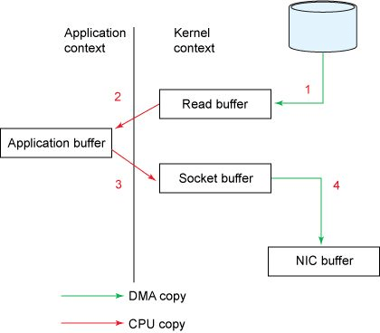

如图，如果采用传统的 IO 流程，先读取网络 IO，再写入磁盘 IO，实际需要将数据 Copy 四次。

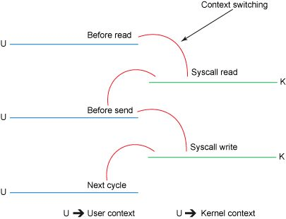

1. 第一次：读取磁盘文件到操作系统内核缓冲区；
2. 第二次：将内核缓冲区的数据，copy 到应用程序的 buffer；
3. 第三步：将应用程序 buffer 中的数据，copy 到 socket 网络发送缓冲区；
4. 第四次：将 socket buffer 的数据，copy 到网卡，由网卡进行网络传输。

> “
>
> 啊，操作系统这么傻吗？copy 来 copy 去的。
>
> ”

并不是操作系统傻，操作系统的设计就是每个应用程序都有自己的用户内存，用户内存和内核内存隔离，这是为了程序和系统安全考虑，否则的话每个应用程序内存满天飞，随意读写那还得了。

不过，还有零拷贝技术，英文——Zero-Copy。零拷贝就是尽量去减少上面数据的拷贝次数，从而减少拷贝的 CPU 开销，减少用户态内核态的上下文切换次数，从而优化数据传输的性能。

常见的零拷贝思路主要有三种：

- 直接 I/O：数据直接跨过内核，在用户地址空间与 I/O 设备之间传递，内核只是进行必要的虚拟存储配置等辅助工作；
- 避免内核和用户空间之间的数据拷贝：当应用程序不需要对数据进行访问时，则可以避免将数据从内核空间拷贝到用户空间；
- 写时复制：数据不需要提前拷贝，而是当需要修改的时候再进行部分拷贝。

**Kafka 使用到了 mmap和 sendfile的方式来实现零拷贝。分别对应 Java 的 MappedByteBuffer和 FileChannel.transferTo。**

**使用 Java NIO 实现零拷贝，如下：**

**FileChannel.transferTo**

在此模型下，上下文切换的数量减少到一个。具体而言，transferTo方法指示块设备通过 DMA 引擎将数据读取到读取缓冲区中。然后，将该缓冲区复制到另一个内核缓冲区以暂存到套接字。最后，套接字缓冲区通过 DMA 复制到 NIC 缓冲区。

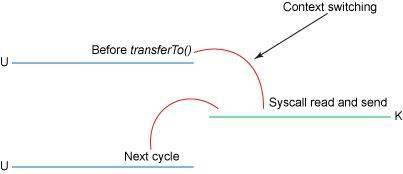

我们将副本数从四减少到三，并且这些副本中只有一个涉及 CPU。我们还将上下文切换的数量从四个减少到了两个。这是一个很大的改进，但是还没有查询零副本。当运行 Linux 内核 2.4 及更高版本以及支持收集操作的网络接口卡时，后者可以作为进一步的优化来实现。如下所示。

根据前面的示例，调用transferTo方法会使设备通过 DMA 引擎将数据读取到内核读取缓冲区中。但是，使用gather操作时，读取缓冲区和套接字缓冲区之间没有复制。取而代之的是，给 NIC 一个指向读取缓冲区的指针以及偏移量和长度，该偏移量和长度由 DMA 清除。CPU 绝对不参与复制缓冲区。

**关于零拷贝详情，可以详读这篇文章零拷贝 (Zero-copy) 浅析及其应用。**

PageCache

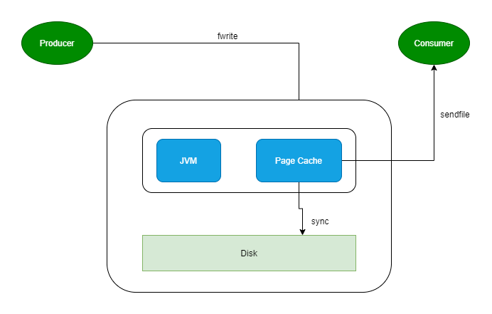

producer 生产消息到 Broker 时，Broker 会使用 pwrite 系统调用【对应到 Java NIO 的 FileChannel.write API】按偏移量写入数据，此时数据都会先写入page cache。consumer 消费消息时，Broker 使用 sendfile 系统调用【对应 FileChannel.transferTo API】，零拷贝地将数据从 page cache 传输到 broker 的 Socket buffer，再通过网络传输。

leader 与 follower 之间的同步，与上面 consumer 消费数据的过程是同理的。

page cache中的数据会随着内核中 flusher 线程的调度以及对 sync/fsync 的调用写回到磁盘，就算进程崩溃，也不用担心数据丢失。另外，如果 consumer 要消费的消息不在page cache里，才会去磁盘读取，并且会顺便预读出一些相邻的块放入 page cache，以方便下一次读取。

因此如果 Kafka producer 的生产速率与 consumer 的消费速率相差不大，那么就能几乎只靠对 broker page cache 的读写完成整个生产 - 消费过程，磁盘访问非常少。

网络模型

> “
>
> 网络嘛，作为 Java 程序员，自然是 Netty
>
> ”

是的，Netty 是 JVM 领域一个优秀的网络框架，提供了高性能的网络服务。大多数 Java 程序员提到网络框架，首先想到的就是 Netty。Dubbo、Avro-RPC 等等优秀的框架都使用 Netty 作为底层的网络通信框架。

Kafka 自己实现了网络模型做 RPC。底层基于 Java NIO，采用和 Netty 一样的 Reactor 线程模型。

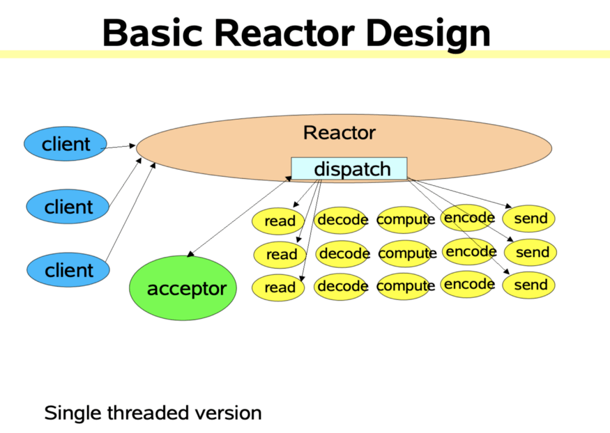

Reacotr 模型主要分为三个角色

- Reactor：把 IO 事件分配给对应的 handler 处理
- Acceptor：处理客户端连接事件
- Handler：处理非阻塞的任务

在传统阻塞 IO 模型中，每个连接都需要独立线程处理，当并发数大时，创建线程数多，占用资源；采用阻塞 IO 模型，连接建立后，若当前线程没有数据可读，线程会阻塞在读操作上，造成资源浪费

针对传统阻塞 IO 模型的两个问题，Reactor 模型基于池化思想，避免为每个连接创建线程，连接完成后将业务处理交给线程池处理；基于 IO 复用模型，多个连接共用同一个阻塞对象，不用等待所有的连接。遍历到有新数据可以处理时，操作系统会通知程序，线程跳出阻塞状态，进行业务逻辑处理

Kafka 即基于 Reactor 模型实现了多路复用和处理线程池。其设计如下：

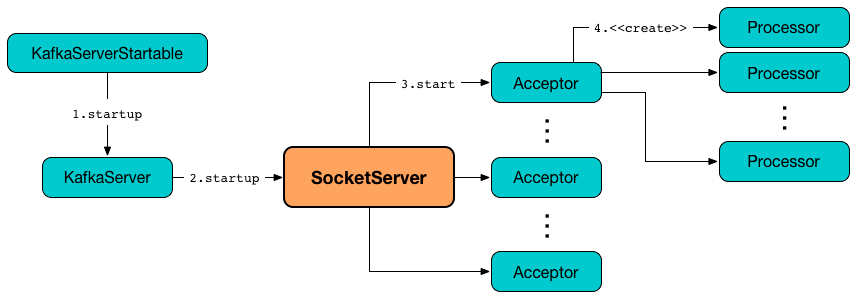

其中包含了一个Acceptor线程，用于处理新的连接，Acceptor有 N 个 Processor线程 select 和 read socket 请求，N 个 Handler线程处理请求并相应，即处理业务逻辑。

I/O 多路复用可以通过把多个 I/O 的阻塞复用到同一个 select 的阻塞上，从而使得系统在单线程的情况下可以同时处理多个客户端请求。它的最大优势是系统开销小，并且不需要创建新的进程或者线程，降低了系统的资源开销。

总结：Kafka Broker 的 KafkaServer设计是一个优秀的网络架构，有想了解 Java 网络编程，或需要使用到这方面技术的同学不妨去读一读源码。

批量与压缩

Kafka Producer 向 Broker 发送消息不是一条消息一条消息的发送。使用过 Kafka 的同学应该知道，Producer 有两个重要的参数：batch.size和linger.ms。这两个参数就和 Producer 的批量发送有关。

Kafka Producer 的执行流程如下图所示

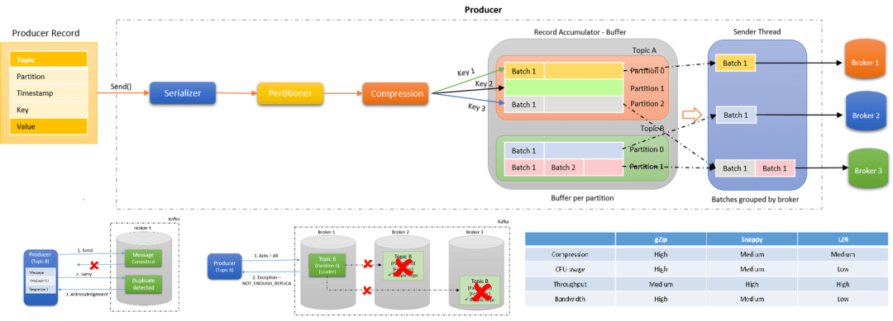

发送消息依次经过以下处理器：

- Serialize：键和值都根据传递的序列化器进行序列化。优秀的序列化方式可以提高网络传输的效率。
- Partition：决定将消息写入主题的哪个分区，默认情况下遵循 murmur2 算法。自定义分区程序也可以传递给生产者，以控制应将消息写入哪个分区。
- Compress：默认情况下，在 Kafka 生产者中不启用压缩.Compression 不仅可以更快地从生产者传输到代理，还可以在复制过程中进行更快的传输。压缩有助于提高吞吐量，降低延迟并提高磁盘利用率。
- Accumulate： Accumulate 顾名思义，就是一个消息累计器。其内部为每个 Partition 维护一个 Deque 双端队列，队列保存将要发送的批次数据， Accumulate 将数据累计到一定数量，或者在一定过期时间内，便将数据以批次的方式发送出去。记录被累积在主题每个分区的缓冲区中。根据生产者批次大小属性将记录分组。主题中的每个分区都有一个单独的累加器 / 缓冲区。
- Group Send：记录累积器中分区的批次按将它们发送到的代理分组。批处理中的记录基于 batch.size 和 linger.ms 属性发送到代理。记录由生产者根据两个条件发送。当达到定义的批次大小或达到定义的延迟时间时。

Kafka 支持多种压缩算法：lz4、snappy、gzip。Kafka 2.1.0 正式支持 ZStandard —— ZStandard 是 Facebook 开源的压缩算法，旨在提供超高的压缩比 (compression ratio)，具体细节参见 zstd。

Producer、Broker 和 Consumer 使用相同的压缩算法，在 producer 向 Broker 写入数据，Consumer 向 Broker 读取数据时甚至可以不用解压缩，最终在 Consumer Poll 到消息时才解压，这样节省了大量的网络和磁盘开销。

分区并发

Kafka 的 Topic 可以分成多个 Partition，每个 Paritition 类似于一个队列，保证数据有序。同一个 Group 下的不同 Consumer 并发消费 Paritition，分区实际上是调优 Kafka 并行度的最小单元，因此，可以说，每增加一个 Paritition 就增加了一个消费并发。

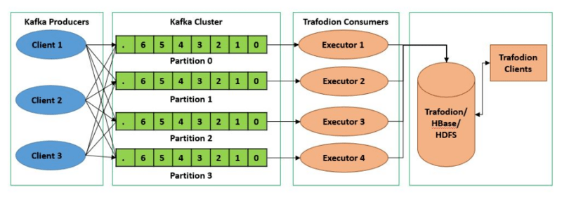

Kafka 具有优秀的分区分配算法——StickyAssignor，可以保证分区的分配尽量地均衡，且每一次重分配的结果尽量与上一次分配结果保持一致。这样，整个集群的分区尽量地均衡，各个 Broker 和 Consumer 的处理不至于出现太大的倾斜。

> “
>
> 那是不是分区数越多越好呢？
>
> ”

当然不是。

越多的分区需要打开更多的文件句柄

在 kafka 的 broker 中，每个分区都会对照着文件系统的一个目录。在 kafka 的数据日志文件目录中，每个日志数据段都会分配两个文件，一个索引文件和一个数据文件。因此，随着 partition 的增多，需要的文件句柄数急剧增加，必要时需要调整操作系统允许打开的文件句柄数。

客户端 / 服务器端需要使用的内存就越多

客户端 producer 有个参数 batch.size，默认是 16KB。它会为每个分区缓存消息，一旦满了就打包将消息批量发出。看上去这是个能够提升性能的设计。不过很显然，因为这个参数是分区级别的，如果分区数越多，这部分缓存所需的内存占用也会更多。

降低高可用性

分区越多，每个 Broker 上分配的分区也就越多，当一个发生 Broker 宕机，那么恢复时间将很长。

文件结构

Kafka 消息是以 Topic 为单位进行归类，各个 Topic 之间是彼此独立的，互不影响。每个 Topic 又可以分为一个或多个分区。每个分区各自存在一个记录消息数据的日志文件。

Kafka 每个分区日志在物理上实际按大小被分成多个 Segment。

- segment file 组成：由 2 大部分组成，分别为 index file 和 data file，此 2 个文件一一对应，成对出现，后缀”.index”和“.log”分别表示为 segment 索引文件、数据文件。
- segment 文件命名规则：partion 全局的第一个 segment 从 0 开始，后续每个 segment 文件名为上一个 segment 文件最后一条消息的 offset 值。数值最大为 64 位 long 大小，19 位数字字符长度，没有数字用 0 填充。

index 采用稀疏索引，这样每个 index 文件大小有限，Kafka 采用mmap的方式，直接将 index 文件映射到内存，这样对 index 的操作就不需要操作磁盘 IO。mmap的 Java 实现对应 MappedByteBuffer。

> “
>
> mmap 是一种内存映射文件的方法。即将一个文件或者其它对象映射到进程的地址空间，实现文件磁盘地址和进程虚拟地址空间中一段虚拟地址的一一对映关系。实现这样的映射关系后，进程就可以采用指针的方式读写操作这一段内存。
>
> 而系统会自动回写脏页面到对应的文件磁盘上，即完成了对文件的操作而不必再调用 read,write 等系统调用函数。相反，内核空间对这段区域的修改也直接反映用户空间，从而可以实现不同进程间的文件共享。
>
> ”

Kafka 充分利用二分法来查找对应 offset 的消息位置：

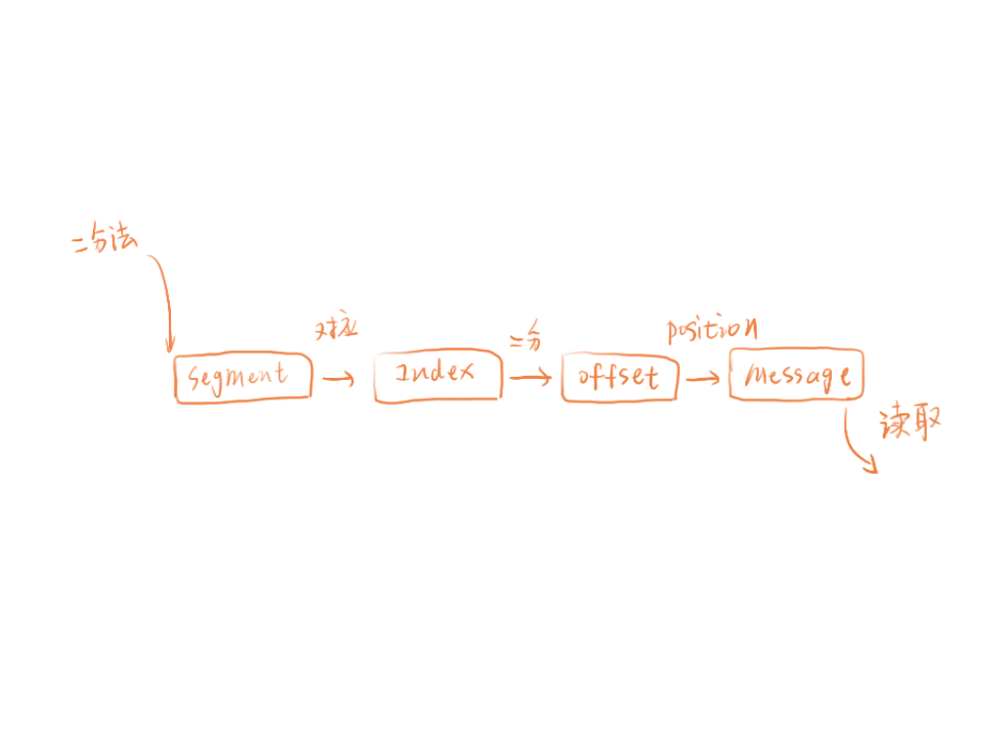

1. 按照二分法找到小于 offset 的 segment 的.log 和.index
2. 用目标 offset 减去文件名中的 offset 得到消息在这个 segment 中的偏移量。
3. 再次用二分法在 index 文件中找到对应的索引。
4. 到 log 文件中，顺序查找，直到找到 offset 对应的消息。

总结

Kafka 是一个优秀的开源项目。其在性能上面的优化做的淋漓尽致，是很值得我们深入学习的一个项目。无论是思想还是实现，我们都应该认真的去看一看，想一想。

**END**

**官方站点：www.linuxprobe.com**

**Linux命令大全：www.linuxcool.com**