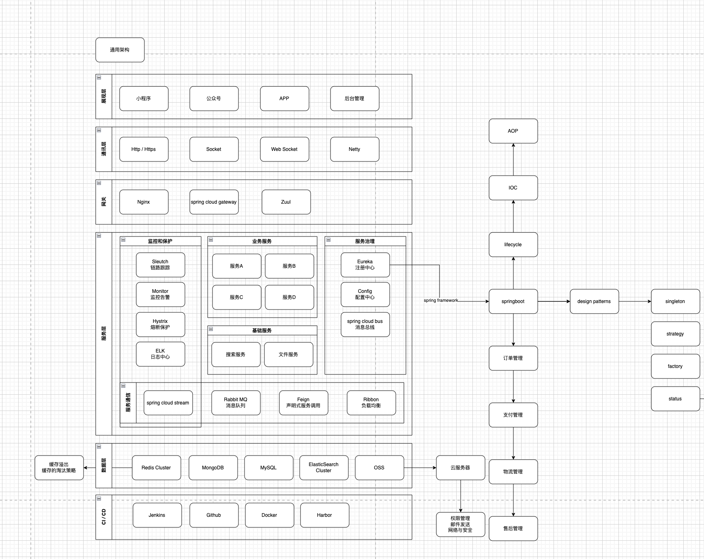

# 通用架构

# CAP原理以及分布式系统支持的组合以及为何不支持CA

**CAP原理**

CAP原理，也被称为Brewer定理，是Eric Brewer在2000年提出的关于分布式系统设计和实现的重要思想。它描述了在分布式系统中，一致性（Consistency）、可用性（Availability）和分区容错性（Partition tolerance）这三个特性只能同时满足其中的两个，无法三个兼得。

1. **一致性（Consistency）**：在任何时候，所有节点都能够访问到同样的数据，并且这些数据的状态是一致的。
2. **可用性（Availability）**：系统能够在任何时候处理请求并返回结果，即使有一些节点出现了故障。
3. **分区容错性（Partition tolerance）**：系统能够在网络分区的情况下继续运行，并保证数据的一致性和可用性。

**分布式系统支持的组合**

由于CAP原理的限制，分布式系统只能选择以下两种组合：

- **CP**：保证一致性和分区容错性，但可能牺牲可用性。例如，MongoDB、Redis、HBase等系统采用CP组合。
- **AP**：保证可用性和分区容错性，但可能牺牲一致性。例如，Cassandra、CouchDB等系统采用AP组合。

**为何不支持CA**

在分布式系统中，由于网络本身就无法做到100%的可靠，所以出现分区是一个必然的现象。如果放弃了分区容错性（P），而选择一致性（C）和可用性（A），那么当分布式环境出现分区现象时，如果各个节点都分别操作一下数据，就很可能出现数据不一致的情况。而为了保证一致性（C），系统就得禁止写入操作，这就与可用性（A）冲突了，因为可用性要求非故障的节点要能在合理的时间返回正常的响应。因此，在分布式环境下，是无法做到CA的。同时，由于分区容错性（P）是必然要素，所以可以根据业务，选择CP或者AP类型。

# 秒杀系统如何设计实现

秒杀系统的设计实现是一个复杂且需要综合考虑多个方面的过程。以下是一个详细的秒杀系统设计实现的方案，包括关键技术和策略：

**一、系统概述**

秒杀系统旨在处理大量用户在极短时间内对少量商品的抢购请求，其特点是瞬时高并发、数据一致性要求高、用户体验需求高。因此，系统设计需要重点考虑性能、可用性和用户体验。

**二、设计原则**

1. **稳：**保证系统在高并发下的稳定性，避免崩溃或宕机。
2. **准**：确保数据一致性，防止超卖或漏卖。
3. **快：**优化系统性能，提高响应速度，提升用户体验。

**三、关键技术及策略**

1. **缓存技术**
   - 服务端缓存：使用Redis等内存数据库缓存热点数据，如商品信息、用户信息等，减少数据库访问压力。
   - CDN加速：通过CDN加速页面静态资源的访问，提高用户访问速度。
   - 页面静态化：将活动页面进行静态化处理，减少服务端请求，提高系统性能。
2. **分布式架构**
   - 分布式缓存：使用Redis集群等分布式缓存技术，提高缓存系统的性能和可用性。
   - 分布式数据库：采用分布式数据库技术，如MyCat等，实现数据库的水平扩展，提高系统并发处理能力。
   - 分布式锁：使用分布式锁技术，如Redis分布式锁，保证数据一致性。
3. **限流与降级**
   - 限流：通过限流策略，如令牌桶算法、漏桶算法等，控制用户请求速率，防止系统过载。
   - 降级：在系统压力过大时，通过降级策略，如关闭部分功能、简化业务流程等，保障核心功能的正常运行。
4. **秒杀按钮与URL设计**
   - 秒杀按钮：在秒杀开始前，秒杀按钮置灰不可点击；秒杀开始时，按钮变为可点击状态，并生成动态化的秒杀URL，防止恶意攻击。
   - URL设计：实现动态化的秒杀URL，确保即使开发人员也无法在秒杀开始前知道具体的URL。
5. **数据库设计**
   - 数据库表设计：合理设计用户表、商品表、订单表等数据库表结构，满足秒杀业务需求。
   - 数据库优化：通过索引优化、SQL优化等手段，提高数据库查询性能。
   - 分布式事务：采用分布式事务解决方案，如TCC、SAGA等，保证数据一致性。
6. **负载均衡与容灾**
   - 负载均衡：使用Nginx等负载均衡技术，将用户请求分发到多个服务器上，提高系统并发处理能力。
   - 容灾备份：部署容灾备份系统，确保在单点故障时能够迅速恢复服务。
7. **监控与告警**
   - 监控：实时监控系统各项指标，如请求量、响应时间、错误率等，确保系统稳定运行。
   - 告警：设置告警阈值，当系统指标超过阈值时自动发送告警通知，及时发现问题并处理。

**四、总结**

秒杀系统的设计实现是一个复杂的过程，需要综合考虑性能、可用性和用户体验等多个方面。通过采用缓存技术、分布式架构、限流与降级、秒杀按钮与URL设计、数据库设计、负载均衡与容灾以及监控与告警等关键技术及策略，可以构建出一个稳定、高效、安全的秒杀系统。

